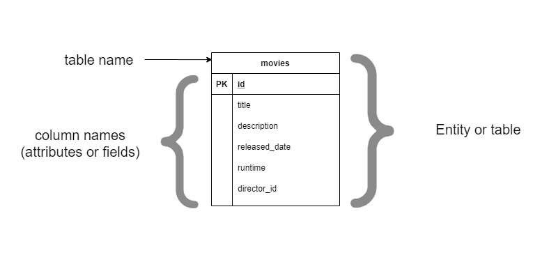
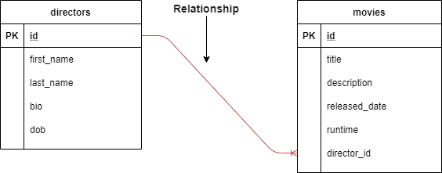
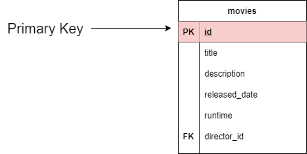
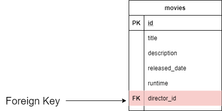
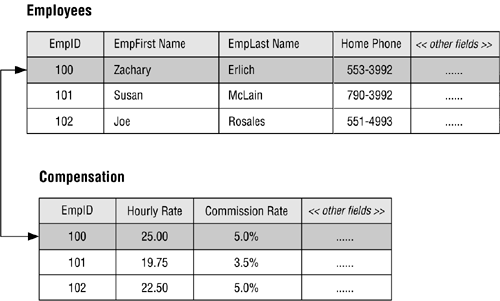
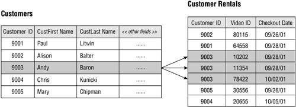
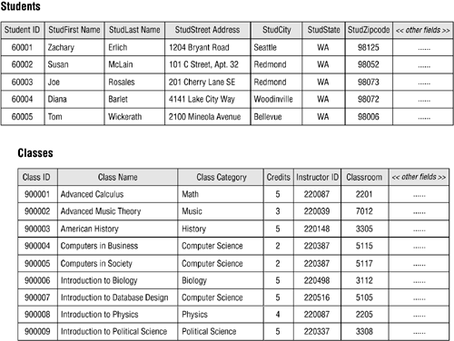
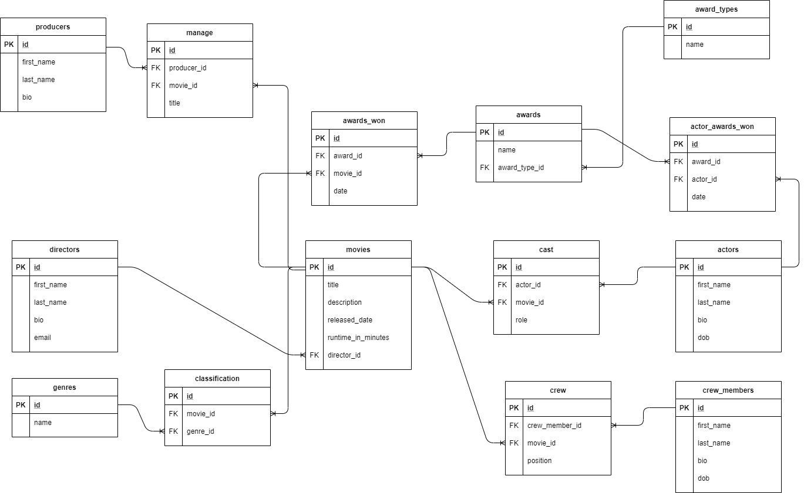

# W5D2 - Database Design

## Content
- Entity Relationship Diagrams
- Primary Keys/Foreign Keys
- Data Types
- Relationship Types
- Naming Conventions
- Normalization
- Design Concepts
- Breakout: Convert 2 Spreadsheets [15 mins]
- Movie ERD

## Entity Relationship Diagram (ERD)

- A visual depiction of the database tables and how they are related to each other
- Extremely useful for reasoning about how the database should be structured
- Can be created using pen and paper, a whiteboard, or using an online application

ER modelling is based on two concepts:

- Entities, defined as tables that hold specific information (data)
- Relationships, defined as the associations or interactions between entities

### Entity

An entity is an object in the real world with an independent existence that can be differentiated from other objects. An entity might be

- An object with physical existence (e.g., a lecturer, a student, a car)
- An object with conceptual existence (e.g., a course, a job, a position)

The principal storage units are called columns or fields or attributes. These house the basic components of data into which your content can be broken down. 

- 

### Relationship

Relationships are used to connect related information between tables.

- 

### Primary Key

- A way of uniquely identifying a particular record within a table 
- Must be unique (within the table) and can never be null
- The usual data type is auto-incrementing integer (`INTEGER` or `BIGINT`)
- A Primary Key stored in another table is known as a `Foreign Key`
- The Primary Key and Foreign Key **MUST** be the same data type

- 

### Foreign Key

A foreign key (FK) is an attribute in a table that references the primary key in another table OR it can be null. Both foreign and primary keys must be of the same data type.

### Naming Conventions

- Table and field names are written in `snake_case`
- Table names are always pluralized
- The primary key for each table will simply be called `id`
- A foreign key is made up of the singular of the primary keys table and the suffix `_id` (eg. `user_id` is the foreign key for the `id` field in the `users` table)

### Data Types

- Each field in a table **must** have a data type defined for it
- The data type tells the database how much room to set aside to store the value _and_ allows the database to perform type validation on data before insertion (to protect the data integrity of the table)
- Choosing the perfect data type is less of a concern nowadays because memory is now comparably cheap

- VARCHAR (255)
- TEXT 
- INTEGER
- FLOAT
- BOOLEAN
- ARRAY
- JSON

### Relationship Types

The relationship type represent the **cardinality of the relationship**

- **One-to-One**: One record in the first table is related to one (and only one) record in the second table

- **One-to-Many**: One record in the first table is related to one or more records in the second table

- **Many-to-Many**: One or more records in the first table are related to one or more records in the second table

- It could be argued that there is really only one relationship type: _One-to-Many_ as One-to-One's are extremely rare and Many-to-Many's are implemented using two _One-to-Many's_

### Normalization

- The process of designing (and redesigning) a relational database to 
  1. reduce duplicated data
  2. ensure data integrity
- This will help to improve the structure of the data
- Beware: taking this process too far can result in extremely complex queries to retrieve related data

* [Database Normalization](https://www.studytonight.com/dbms/database-normalization.php)

### Design Concepts

- Make fields required based on the records state upon initial creation (remember that additional data can be added to a record after it has been created)
- Intelligent default values can be set for fields (such as the current timestamp for a `created_on` field)
- Don't use calculated fields (a field that can be derived from one or more other fields, such as `full_name` is a combination of `first_name` and `last_name`)
- Pull repeated values out to their own table and make reference to them with a foreign key
- Try not to delete anything (use a boolean flag instead to mark a record as active or inactive)
- Consider using a `type` field instead of using two (or more) tables to store very similar data (eg. create an `orders` table with an `order_type` field instead of a `purchase_orders` and a `sales_orders` table)

### Breakout: Convert Two Spreadsheets
- [Gist with instruction](https://gist.github.com/andydlindsay/20e7305e853bad7b587f294b054cf8de)

### IMDB Clone
We created an ERD for a fictional IMDB competitor:

### Useful Links
* [Database Normalization](https://www.studytonight.com/dbms/database-normalization.php)
* [Postgres Data Types](http://www.postgresqltutorial.com/postgresql-data-types/)
* [Relationship Types](http://etutorials.org/SQL/Database+design+for+mere+mortals/Part+II+The+Design+Process/Chapter+10.+Table+Relationships/Types+of+Relationships/)
* [draw.io (online ERD)](https://www.draw.io/)
